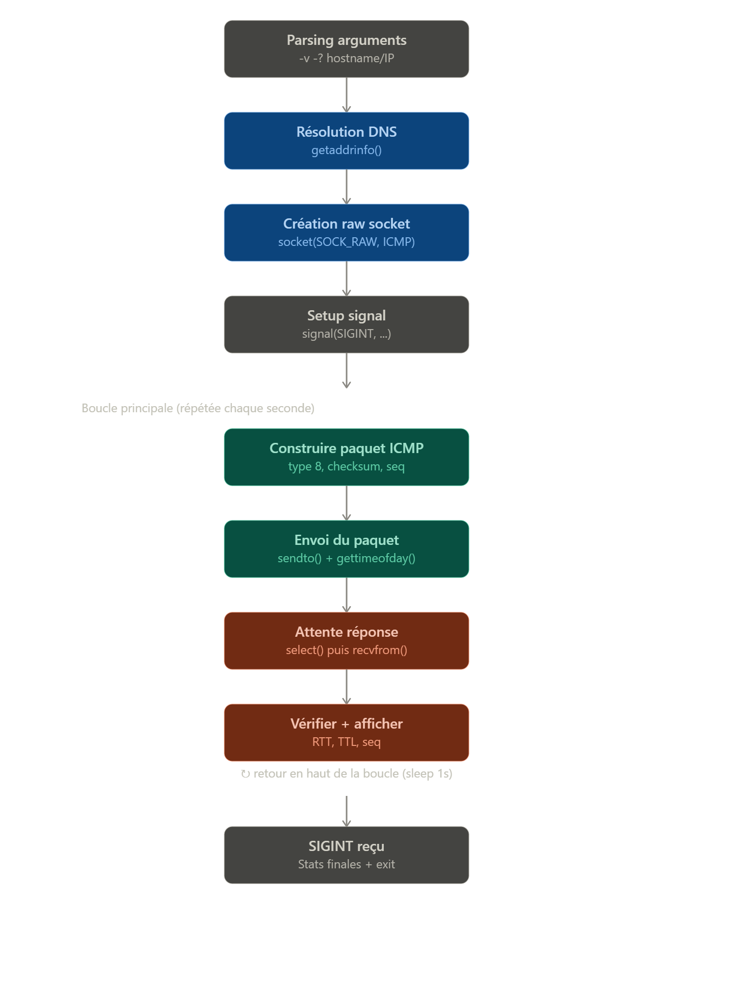
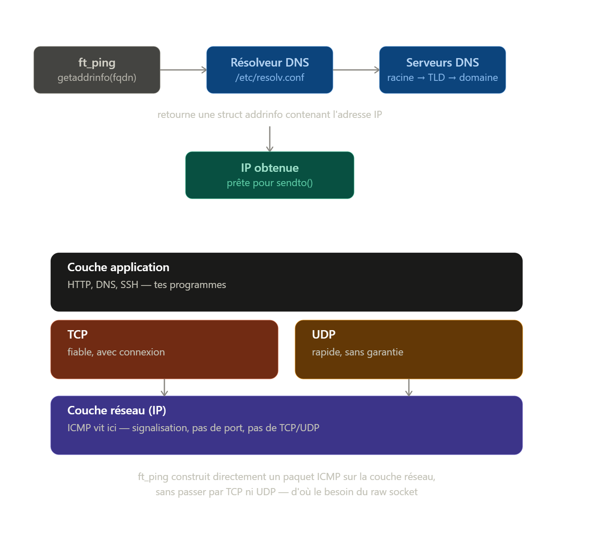
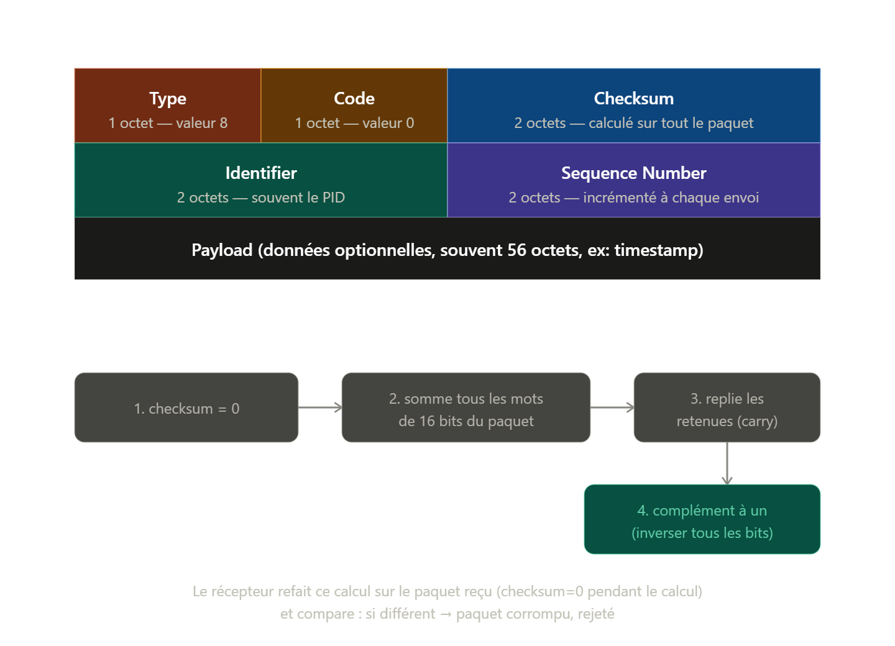

Voilà le flux complet du programme, du parsing d'arguments à la boucle d'envoi/réception :

1. Comprendre ce qu'est réellement ping

ping ne fait pas de TCP ni d'UDP. Il envoie des paquets ICMP (Internet Control Message Protocol), un protocole de la couche réseau (niveau 3), utilisé pour la signalisation entre machines IP — pas pour transporter des données applicatives.

Concrètement :

Tu construis toi-même un paquet ICMP de type Echo Request (type 8)
Tu l'envoies à la machine cible
Si la machine est joignable, son noyau répond automatiquement avec un Echo Reply (type 0)
Tu mesures le temps écoulé entre l'envoi et la réception → le RTT (round-trip time)

2. C'est quoi un FQDN ?

FQDN = Fully Qualified Domain Name (nom de domaine pleinement qualifié). C'est un nom de machine complet et non-ambigu, du genre www.google.com ou mail.42.fr. Il se lit de droite à gauche dans une hiérarchie :

www . google . com .
 |       |      |    |
 |       |      |    └── racine (implicite, souvent omise)
 |       |      └────── TLD (top-level domain)
 |       └───────────── domaine
 └───────────────────── sous-domaine / hôte

Un FQDN, c'est un nom lisible par un humain. Mais le réseau IP ne comprend pas les noms, il ne comprend que des adresses IP (ex: 142.250.201.68). Il faut donc un système qui fasse la traduction.

3. C'est quoi le DNS ?

Le DNS (Domain Name System) est ce système de traduction. C'est une immense base de données distribuée mondialement, organisée en arbre, qui répond à la question : "quelle est l'adresse IP associée à ce nom ?"

Quand ta machine veut résoudre www.google.com, elle interroge un serveur DNS (généralement celui de ton FAI ou configuré dans /etc/resolv.conf), qui va potentiellement interroger d'autres serveurs DNS en cascade (racine → .com → google.com) jusqu'à obtenir la réponse, puis te la renvoie.

Pourquoi c'est important pour ton projet : le sujet dit "gérer les FQDN sans faire de résolution DNS sur le paquet de retour". Ça veut dire : tu résous le nom en IP une fois au début (pour savoir où envoyer le paquet), mais quand tu reçois la réponse ICMP, tu n'essaies pas de re-transformer l'IP source en nom — le vrai ping fait ça par défaut mais toi tu dois t'en abstenir (sauf en bonus).

4. TCP vs UDP — et pourquoi ICMP n'est ni l'un ni l'autre

Ce sont deux protocoles de la couche transport, au-dessus d'IP :

TCP (Transmission Control Protocol) : orienté connexion, fiable. Il garantit que les données arrivent dans l'ordre, sans perte (retransmission automatique), avec un contrôle de flux. Utilisé pour HTTP, SSH, email... Coût : plus lourd, poignée de main (handshake), accusés de réception.
UDP (User Datagram Protocol) : sans connexion, pas de garantie de livraison ni d'ordre. Léger et rapide. Utilisé pour le streaming, le DNS justement, les jeux en ligne.

ICMP, lui, n'est ni TCP ni UDP — c'est un protocole de la couche réseau (même niveau qu'IP), pas de la couche transport. Il sert à la signalisation et au diagnostic réseau (erreurs, disponibilité), pas au transport de données applicatives. C'est pour ça que ping n'a pas de "port" comme le fait une connexion TCP/UDP — il n'y a pas de notion de port en ICMP.

Un petit schéma pour visualiser où se situe chaque protocole et comment getaddrinfo s'intègre dans le flux :

5. Comment fonctionne getaddrinfo() concrètement

C'est la fonction moderne (recommandée depuis longtemps, remplace gethostbyname qui est obsolète) pour résoudre un nom en adresse. Son intérêt : elle gère à la fois les IP littérales (8.8.8.8) et les FQDN (google.com), et elle est compatible IPv4/IPv6.

Signature :

c
int getaddrinfo(const char *node, const char *service,
                 const struct addrinfo *hints,
                 struct addrinfo **res);
node : ton hostname ou IP en string (ex: "google.com" ou "8.8.8.8")
service : nom de service ou port — pour ICMP tu peux mettre NULL, ça ne concerne pas ton cas puisqu'il n'y a pas de port
hints : une structure addrinfo que tu pré-remplis pour filtrer ce que tu veux (ex: forcer IPv4 avec ai_family = AF_INET)
res : un pointeur vers une liste chaînée de résultats possibles (une machine peut avoir plusieurs IP)

Exemple minimal adapté à ton projet :

c
struct addrinfo hints, *res;
memset(&hints, 0, sizeof(hints));
hints.ai_family = AF_INET;       // on force IPv4 (le sujet dit "simple IPv4")
hints.ai_socktype = SOCK_RAW;

int status = getaddrinfo("google.com", NULL, &hints, &res);
if (status != 0) {
    fprintf(stderr, "ft_ping: unknown host\n");
    exit(1);
}

// res->ai_addr contient maintenant la struct sockaddr avec l'IP résolue
struct sockaddr_in *addr = (struct sockaddr_in *)res->ai_addr;
// tu peux ensuite utiliser addr->sin_addr pour ton sendto()

freeaddrinfo(res); // toujours libérer la liste chaînée après usage !

Points importants pour ton projet :

Ne pas oublier freeaddrinfo() — sinon fuite mémoire (et le sujet interdit tout crash/leak)
Si tu reçois déjà une IP littérale en argument (8.8.8.8), getaddrinfo la gère aussi directement, pas besoin de distinguer les deux cas dans ton code
C'est uniquement à cette étape que tu fais de la résolution DNS — jamais sur l'IP source du paquet ICMP que tu reçois en retour, comme précisé dans le sujet

6. construire un packet icmp
La structure d'un en-tête ICMP Echo Request

Un paquet ICMP Echo Request fait 8 octets d'en-tête, suivis de données optionnelles (le vrai ping ajoute généralement 56 octets de payload par défaut). Voici le format exact (RFC 792) :
 0                   1                   2                   3
 0 1 2 3 4 5 6 7 8 9 0 1 2 3 4 5 6 7 8 9 0 1 2 3 4 5 6 7 8 9 0 1
+-+-+-+-+-+-+-+-+-+-+-+-+-+-+-+-+-+-+-+-+-+-+-+-+-+-+-+-+-+-+-+-+
|     Type      |     Code      |          Checksum             |
+-+-+-+-+-+-+-+-+-+-+-+-+-+-+-+-+-+-+-+-+-+-+-+-+-+-+-+-+-+-+-+-+
|           Identifier          |        Sequence Number        |
+-+-+-+-+-+-+-+-+-+-+-+-+-+-+-+-+-+-+-+-+-+-+-+-+-+-+-+-+-+-+-+-+
|                             Payload...                        |

Type (1 octet) : 8 pour Echo Request, 0 pour Echo Reply
Code (1 octet) : toujours 0 pour Echo
Checksum (2 octets) : calculé sur tout le paquet ICMP (on y revient)
Identifier (2 octets) : identifie ton processus (souvent le PID), utile si plusieurs ping tournent en même temps
Sequence Number (2 octets) : incrémenté à chaque paquet envoyé, permet de savoir lequel répond à quoi et de détecter les pertes

En C, ta structure libc s'appelle struct icmphdr (dans <netinet/ip_icmp.h>) :

c
struct icmphdr {
    uint8_t  type;
    uint8_t  code;
    uint16_t checksum;
    union {
        struct {
            uint16_t id;
            uint16_t sequence;
        } echo;
        uint32_t gateway;
    } un;
};

C'est quoi le checksum, à quoi ça sert ?

Le checksum est une somme de contrôle : une valeur numérique calculée à partir de tout le contenu du paquet, qui sert à détecter la corruption des données pendant le transport.

Pourquoi c'est nécessaire : les paquets réseau traversent plein d'équipements physiques (câbles, routeurs, cartes réseau) qui peuvent, à cause d'erreurs matérielles/électriques, altérer quelques bits en chemin. Sans vérification, tu recevrais un paquet corrompu sans le savoir.

Principe : l'émetteur calcule le checksum et le met dans l'en-tête. Le récepteur refait le même calcul sur le paquet reçu (checksum mis à zéro pendant le calcul) et compare. Si ça ne correspond pas → le paquet est jeté, considéré corrompu.

Important : ce n'est pas de la sécurité/cryptographie — un checksum ne protège pas contre une modification malveillante volontaire (ça, c'est le rôle du chiffrement/signature). C'est juste une détection d'erreur de transmission accidentelle.

L'algorithme ICMP (identique à celui d'IP) est une somme en complément à un sur 16 bits :

